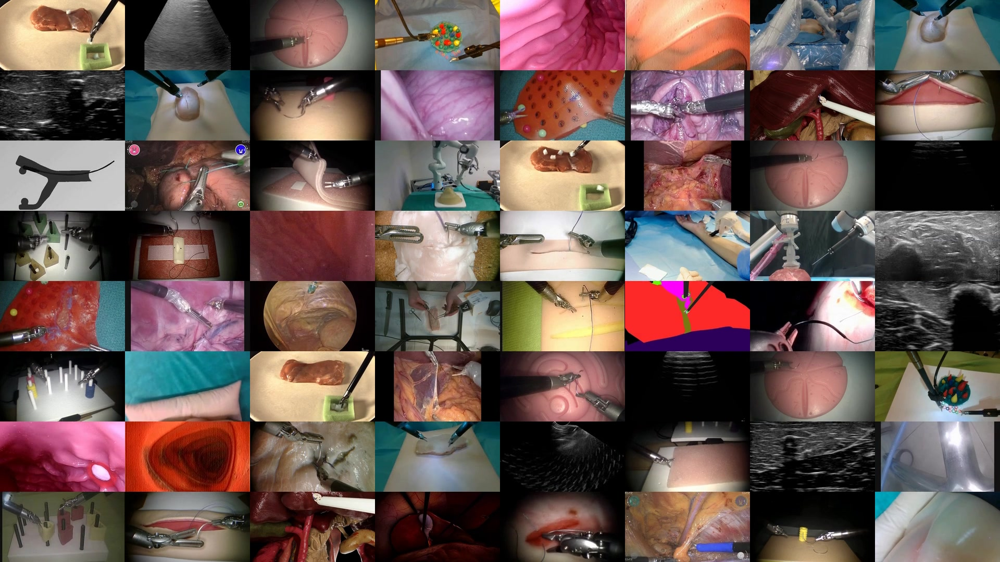

# GR00T-H

[](LICENSE)
[](https://huggingface.co/nvidia/GR00T-H)
[](https://huggingface.co/datasets/nvidia/PhysicalAI-Robotics-Open-H-Embodiment)
[](https://python.org)

A healthcare robotics variant of [GR00T N1.6](https://github.com/NVIDIA/Isaac-GR00T), post-trained on the [Open-H dataset](open_h/README.md) for multi-embodiment surgical and healthcare robot autonomy across 16 robot platforms and 34+ institutions.

<p align="center">
  
</p>

## Overview

GR00T-H post-trains the [GR00T N1.6](https://github.com/NVIDIA/Isaac-GR00T) vision-language-action (VLA) foundation model on surgical robot data from multiple institutions and robot platforms simultaneously. Each institution records data differently — different robots, coordinate conventions, frame rates, camera setups, and state/action representations. GR00T-H solves this by defining per-embodiment modality configs that convert each dataset into a common representation (REL_XYZ_ROT6D for EEF poses) while sharing the core VLA backbone.

The primary additions over upstream Isaac-GR00T live in [`open_h/`](open_h/README.md):
- Per-embodiment modality configs converting 16 healthcare robot datasets to a common action representation
- Multi-embodiment training config and dataset preparation tooling
- Extensions to the data pipeline (clutch-aware filtering, motion scaling, step filtering)

For general robotics use cases, the upstream [Isaac-GR00T](https://github.com/NVIDIA/Isaac-GR00T) project is a better starting point.

## News

- **[March 2026]** — Released GR00T-H with pre-trained checkpoint and the [Open-H dataset](https://huggingface.co/datasets/nvidia/PhysicalAI-Robotics-Open-H-Embodiment)

## Model Variants

| Model | Base Model | Params | Capability | HuggingFace | License |
|-------|-----------|--------|------------|-------------|---------|
| GR00T-H | [GR00T-N1.6-3B](https://huggingface.co/nvidia/GR00T-N1.6-3B) | 3B | Multi-embodiment healthcare robotics (16 surgical platforms) | [Weights](https://huggingface.co/nvidia/GR00T-H) | [NVIDIA-OneWay-Noncommercial-License](https://developer.download.nvidia.com/licenses/NVIDIA-OneWay-Noncommercial-License-22Mar2022.pdf) |

## Quick Start

### Installation

```bash
git clone --recurse-submodules git@github.com:NVIDIA-Medtech/GR00T-H.git
cd GR00T-H
uv sync --python 3.10
uv pip install -e .
```

If `flash-attn` was not built during `uv sync`, install it manually:

```bash
uv pip install flash-attn==2.7.4.post1 --no-build-isolation
```

For containerized setup, see the [Docker Setup Guide](docker/README.md).

### Inference

```bash
uv run python scripts/deployment/standalone_inference_script.py \
  --model-path nvidia/GR00T-H \
  --dataset-path <INSERT_CMR_VERSIUS_DATA_PATH> \
  --embodiment-tag CMR_VERSIUS \
  --traj-ids 0 1 2 \
  --inference-mode pytorch \
  --action-horizon 8
```

For full inference options including TensorRT, see the [inference guide](scripts/deployment/README.md).

### Finetuning on Open-H Embodiments

```bash
uv run torchrun --nproc_per_node=8 --master_port=29500 \
    gr00t/experiment/launch_finetune.py \
    --base-model-path nvidia/GR00T-H \
    --dataset-path <INSERT_CMR_VERSIUS_DATA_PATH> \
    --embodiment-tag CMR_VERSIUS \
    --num-gpus 8 \
    --global-batch-size 32 \
    --max-steps 20000 \
    --output-dir /path/to/output
```

See [open_h/README.md](open_h/README.md) for a deeper dive on finetuning and multi-embodiment training and dataset preparation.

## Open-H Dataset

<p align="center">
  
</p>

The [Open-H dataset](https://huggingface.co/datasets/nvidia/PhysicalAI-Robotics-Open-H-Embodiment) comprises 16 healthcare robot embodiments across 34+ institutions, stored in [LeRobot](https://github.com/huggingface/lerobot) format. See [open_h/embodiments/README.md](open_h/embodiments/README.md) for the full embodiment comparison table.

## Documentation

| Guide | Description |
|-------|-------------|
| [Open-H Overview](open_h/README.md) | GR00T-H additions, embodiment configs, dataset preparation, training |
| [Embodiment Comparison](open_h/embodiments/README.md) | All 16 embodiments — dimensions, cameras, action formats |
| [Action Configuration](open_h/docs/action_configuration.md) | REL_XYZ_ROT6D, rotation formats, adding new embodiments |
| [Data Preparation](open_h/docs/data_preparation.md) | Stats pipeline, temporal statistics, troubleshooting |
| [Inference Guide](scripts/deployment/README.md) | Inference options, TensorRT, server-client architecture |
| [Policy API](getting_started/policy.md) | Observation/action formats, batched inference, environment integration |
| [Finetuning Guide](getting_started/finetune_new_embodiment.md) | Custom embodiment finetuning tutorial |
| [Hardware Recommendations](getting_started/hardware_recommendation.md) | RTX PRO Servers, DGX, Jetson AGX Thor |
| [Docker Setup](docker/README.md) | Containerized environment setup |

## Base Model

GR00T-H builds on [GR00T N1.6](https://github.com/NVIDIA/Isaac-GR00T), a 3B-parameter vision-language-action model combining a Cosmos-Reason-2B VLM with a 32-layer diffusion transformer action head. The base model is pre-trained on 10k+ hours of robot data across bimanual, semi-humanoid, and humanoid embodiments.

<details>
<summary>Base model architecture</summary>

<p align="center">

</p>

</details>

<details>
<summary>Base model inference timing (4 denoising steps, single view)</summary>

| Device | Mode | Data Processing | Backbone | Action Head | E2E | Frequency |
|--------|------|-----------------|----------|-------------|-----|-----------|
| RTX 5090 | torch.compile | 2 ms | 18 ms | 16 ms | 37 ms | 27.3 Hz |
| H100 | torch.compile | 4 ms | 23 ms | 11 ms | 38 ms | 26.3 Hz |
| RTX 4090 | torch.compile | 2 ms | 25 ms | 17 ms | 44 ms | 22.8 Hz |
| Thor | torch.compile | 5 ms | 39 ms | 61 ms | 105 ms | 9.5 Hz |

</details>

## License

| Component | License |
|-----------|---------|
| Source code | [Apache 2.0](https://www.apache.org/licenses/LICENSE-2.0) |
| GR00T-H model weights | [NVIDIA-OneWay-Noncommercial-License](https://developer.download.nvidia.com/licenses/NVIDIA-OneWay-Noncommercial-License-22Mar2022.pdf) |

This project will download and install additional third-party open source software projects. Review the license terms of these open source projects before use.

## Citation

```bibtex
@inproceedings{gr00tn1_2025,
  archivePrefix = {arxiv},
  eprint     = {2503.14734},
  title      = {{GR00T} {N1}: An Open Foundation Model for Generalist Humanoid Robots},
  author     = {NVIDIA and Johan Bjorck and Fernando Castañeda, Nikita Cherniadev and Xingye Da and Runyu Ding and Linxi "Jim" Fan and Yu Fang and Dieter Fox and Fengyuan Hu and Spencer Huang and Joel Jang and Zhenyu Jiang and Jan Kautz and Kaushil Kundalia and Lawrence Lao and Zhiqi Li and Zongyu Lin and Kevin Lin and Guilin Liu and Edith Llontop and Loic Magne and Ajay Mandlekar and Avnish Narayan and Soroush Nasiriany and Scott Reed and You Liang Tan and Guanzhi Wang and Zu Wang and Jing Wang and Qi Wang and Jiannan Xiang and Yuqi Xie and Yinzhen Xu and Zhenjia Xu and Seonghyeon Ye and Zhiding Yu and Ao Zhang and Hao Zhang and Yizhou Zhao and Ruijie Zheng and Yuke Zhu},
  month      = {March},
  year       = {2025},
  booktitle  = {ArXiv Preprint},
}
```

## Resources

- [GR00T-H on HuggingFace](https://huggingface.co/nvidia/GR00T-H) — Model weights and checkpoints
- [Open-H Dataset](https://huggingface.co/datasets/nvidia/PhysicalAI-Robotics-Open-H-Embodiment) — Multi-embodiment healthcare robot benchmark
- [Isaac-GR00T](https://github.com/NVIDIA/Isaac-GR00T) — Upstream base model repository
- [GR00T N1.6 Blog Post](https://research.nvidia.com/labs/gear/gr00t-n1_6/) — Base model details
- [GR00T N1 Paper](https://research.nvidia.com/labs/lpr/publication/gr00tn1_2025/) — Research paper
- [NVIDIA MedTech Open Models](https://github.com/NVIDIA-Medtech)

## Contributing

See [CONTRIBUTING.md](CONTRIBUTING.md) for guidelines.
